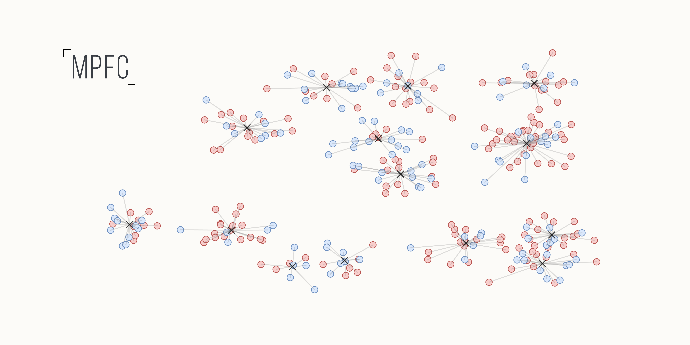
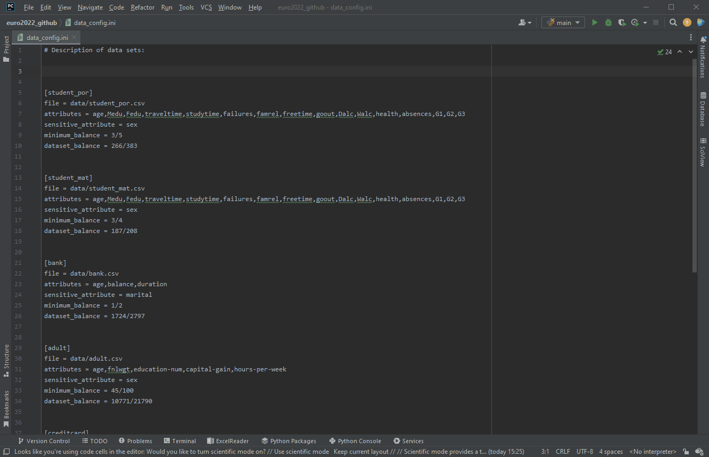
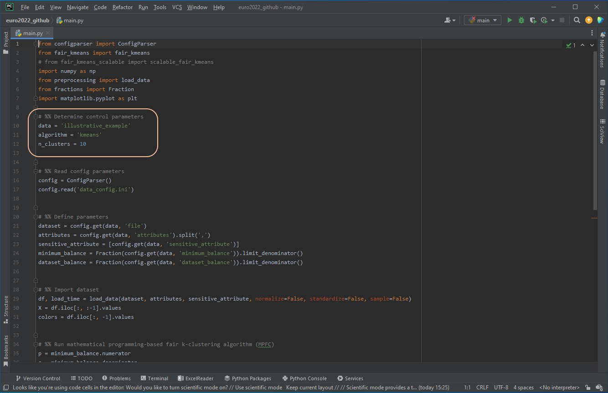

<h1 align="center">
  <br>
  
  

</h1>

<h4 align="center"> Mathematical programming-based fair clustering (MPFC)</h4>

<br>

<p align="justify">
The MPFC-algorithm can be used to automatically assign data points to optimal fair clusters. The assignment is performed such that the balance is preserved in any cluster. This documentation explains how to install and run the MPFC-algorithm.
</p>

## :clipboard: Table of contents
- [Prerequisites](#prerequisites)
- [Installation](#installation)
- [Data sets](#data-sets)
- [Usage](#usage)
- [License](#licence)


## :floppy_disk: Prerequisites
To execute the code, the following software must be installed first. Git is not required when the code of the MPFC module is downloaded as a ZIP folder during the [installation](#installation). 

- [Git](https://git-scm.com/) is an open source distributed version control system. It is used to update the MPFC module to the newest version. For further information, see the official <a href="https://git-scm.com/doc/" target="_blank"> Git Documentation. </a>

- [Python](https://www.python.org/) is the programming language in which the MPFC module was written. For further information, see the official <a href="https://docs.python.org/3/" target="_blank"> Python Documentation. </a>
- [Python Packages:](https://wiki.python.org/moin/UsefulModules#Standard_Library_Enhancements) The MPFC module requires the following modules:

	* [Gurobi](https://anaconda.org/Gurobi/gurobi)
	* [Matplotlib](https://matplotlib.org/)
	* [Numpy](https://anaconda.org/conda-forge/numpy)
	* [Pandas](https://pandas.pydata.org/)
	* [Scikit-Learn](https://scikit-learn.org/stable/)
	* [Scipy](https://anaconda.org/anaconda/scipy)

> **Warning** 
> Gurobi is a commercial mathematical programming solver. Free academic licenses are available [here](https://www.gurobi.com/academia/academic-program-and-licenses/). 

## :rocket: Installation
The most recent version of the MPFC-algorithm is hosted on <a href="https://github.com/" target="_blank"> GitHub. </a> To download the code to your machine, you can either download the code as a ZIP folder or clone the repository using Git. 

### Option 1: Download code as ZIP folder
**Step 1:** Go to the website <a href="https://github.com/phil85/MPFC-Algorithm" target="_blank"> https://github.com/phil85/MPFC-Algorithm </a>

**Step 2:** Select the tab 'Clone or download' and click on 'Download ZIP'. The code is downloaded as a ZIP folder. Unzip the folder and select your desired target location.

---

### Option 2: Clone repository from GitHub
**Step 1:** Go to the website <a href="https://github.com/phil85/MPFC-Algorithm" target="_blank"> https://github.com/phil85/MPFC-Algorithm </a>

**Step 2:** Select the tab 'Clone or download' and copy the SSH key.

**Step 3:** Navigate to the desired location and open Git in terminal (Mac) or with Git Bash (Windows) and type the following command.
``` git
git clone <SSH key>
```
Insert the SSH key after `git clone`.

## :file_folder: Data sets
The table below gives an overview of the data sets used. The second column indicates the number of data points. The third column shows how many features are considered. The fourth column indicates which is the sensitive feature, and the fifth column represents the possible expressions. The sixth column indicates the target balance, which is used in the literature. For more information on the target balance, please refer to the paper by [Backurs et al. (2019)](https://arxiv.org/abs/1902.03519).

| Data set     | # Objects | # Attributes | Sensitive attribute | Protected group    | Target balance |
|-------------|-------------:|----------------:|--------------------:|----------------:|---------------:|
| illustrative example | 100          | 2               | color               | 1,0             | 0.66           |
| student mat  | 395          | 16              | gender              | female, male    | 0.75           |
| student por  | 649          | 16              | gender              | female, male    | 0.60           |
| bank         | 4,520        | 3               | marital-status      | single, married | 0.50           |
| creditcard   | 30,000       | 14              | gender              | female, male    | 0.60           |
| adult        | 32,560       | 5               | gender              | female, male    | 0.45           |
| diabetes     | 101,765      | 2               | gender              | female, male    | 0.80           |
| census1990   | 2,458,285    | 13              | gender              | female, male    | 0.50           |


## :battery: Usage
The starting point of the MPFC-algorithm is the `data_config.ini` file. In this file, new instances can be generated, and the parameters can be determined. Existing instances can also be examined and analyzed with other values for different parameters. For each execution, the following two steps are mandatory.

**Step 1:** Initialization of the data set

In the `data_config.ini` file new data sets can be configured and existing data sets can be changed. The following information is required for each data set:

- **file:** Specifies the directory where the data set is located. The MPFC algorithm imports the data set as a comma-separated values (CSV) file.

- **attributes:** Defines which features are needed to split the data points into clusters. The individual attributes are separated by a comma.

- **sensitive_attribute:** Determines which feature needs to be protected (e.g. gender, color, default, etc.).

- **minimum_balance:** Defines which balance is mandatory in the clustering. The target balance is expressed by the two integer numbers p and q, where the balance is defined as follows: balance = min(p/q, q/p).

- **dataset_balance:** Specifies which balance is present in the dataset.

 
 
**Step 2:** Specification of the control parameters

The `main.py` file contains code that applies the MPFC-algorithm on any given data set.

```python
labels, total_distance, total_time, balance = fair_kmeans(X, n_clusters, colors, p, q, algorithm, random_state)
```

For this purpose, only the control parameters must be determined in the `main.py` file:

- **data:** Specifies the data set which is to be calculated. With this all information and parameters are read from the `data_config.ini` file.

- **algorithm:** Determines which target function should be used for the clustering (kmeans, kmedian, kcenter or kmedoid).

- **n_cluster:** Defines the number of clusters to be constructed in the clustering.


 
## :copyright: License
This project is licensed under the MIT License - see the [LICENSE](LICENSE) file for details.

